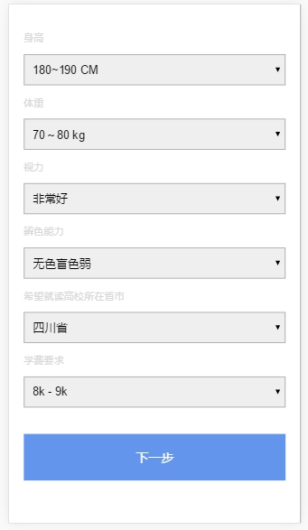

# 零碎代码片段：

> 旋转木马轮播特效（[lunbo](./lunbo)）：

[旋转木马](http://oojestrjh.bkt.clouddn.com/lunbo/index.html "链接")


----
> 随机雪花飘落效果（[snownflake](./random_XueHua.html)）：

[随机雪花](http://oojestrjh.bkt.clouddn.com/random_XueHua.html "雪花")

> 字典键值交换（[dict_Change.py](./dict_Change.py)）：

``` python

''' 字典互换 '''
{'1': 10, '2': 20} => {'10': 1, '20': 2}

```

> 素数（suShu_*.py）：

[suShu_1.py](./suShu_1.py) <br />
[suShu_2.py](./suShu_2.py)

``` python

'''  1 - 100 以内的素数 '''

```

----

> Gulp 的学习使用：

[gulpfile.js](./gulpfile.js)

----

> 移动端响应式表单（form_*.html）:

[form_1.html](./form_1.html) <br />
[form_2.html](./form_2.html)

 <==> 
