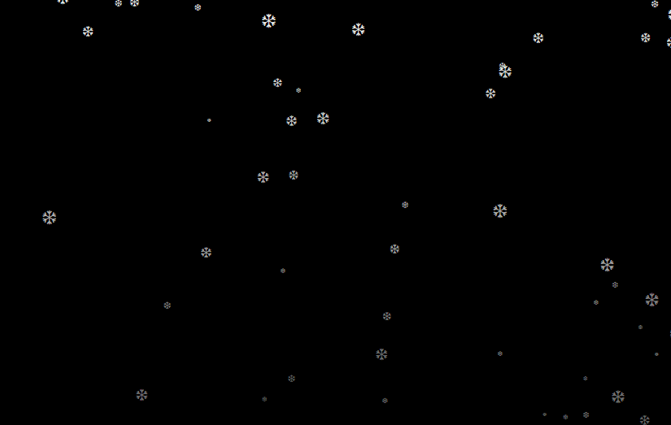

## 零碎代码：

这里整理了平时对于代码的练习.

> 旋转木马轮播特效（[lunbo](./javascript/lunbo)）：

[旋转木马](http://oojestrjh.bkt.clouddn.com/lunbo/index.html "链接")

----

> vue | 扇形扩散 （ [first_vue](./javascript/js_demo/sector_vue.html) ）：

----

> 随机雪花飘落效果（ [snownflake](./javascript/js_demo/random_XueHua.html) ）：

[随机雪花](http://oojestrjh.bkt.clouddn.com/random_XueHua.html "链接")

