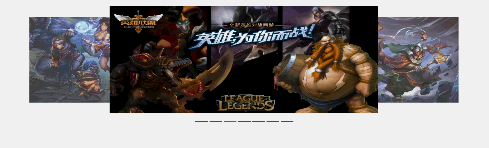
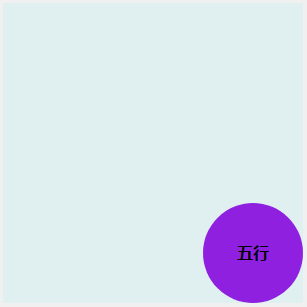

# 零碎代码片段：

> 旋转木马轮播特效（[lunbo](./javascript/lunbo)）：

[旋转木马](http://oojestrjh.bkt.clouddn.com/lunbo/index.html "链接")



----
> vue | 扇形扩散 （ [first_vue](./javascript/first_vue.html) ）：



----
> 随机雪花飘落效果（ [snownflake](./javascript/random_XueHua.html) ）：

[随机雪花](http://oojestrjh.bkt.clouddn.com/random_XueHua.html "雪花")

> 字典键值交换（ [dict_Change.py](./python/dict_Change.py) ）：

``` python

''' 字典互换 '''
{'1': 10, '2': 20} => {'10': 1, '20': 2}

```

> 素数（ suShu_*.py ）：

[suShu_1.py](./python/suShu_1.py) <br />
[suShu_2.py](./python/suShu_2.py)

``` python

'''  1 - 100 以内的素数 '''

```

----

> Gulp 学习使用：

[gulpfile.js](./other/gulpfile.js)
